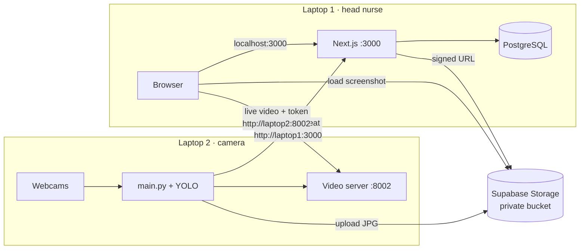

<!-- location: docs/detection-node/LAN_SETUP.md -->
# FallDetect — two-laptop setup on one Wi-Fi

| | Laptop 1 — head nurse | Laptop 2 — camera laptop |
|---|---|---|
| Runs | Next.js web app, PostgreSQL | Python detection service, YOLO, webcams, video server |
| Listens on | port **3000** (alerts, heartbeats) | port **8002** (live video) |
| Needs internet | Yes, to show screenshots (Supabase) | Yes, to upload screenshots (Supabase) |
| Opens | `http://localhost:3000` | — |



If the internet drops, alerts and live video keep working over the Wi-Fi. Only the
screenshots in the alert pop-up go missing.

---

## 1. Before anything: can the laptops reach each other?

Many school, hospital and café networks enable **client isolation**. Every device gets
internet, but devices can't talk to each other. Test this first, after step 3.3 (firewall)
on both laptops:

```powershell
# On laptop 2 (laptop 1's app must be running):
<<<<<<< HEAD
ipconfig
Test-NetConnection <IP> -Port 3000     # use laptop 1's IP
nc -vz <IP> 3000 # mac
# On laptop 1 (demo_stream.py or main.py must be running on laptop 2):
Test-NetConnection <IP> -Port 8002     # use laptop 2's IP
=======
Test-NetConnection 192.168.1.10 -Port 3000     # use laptop 1's IP
nc -vz 192.168.68.113 3000 # mac
# On laptop 1 (demo_stream.py or main.py must be running on laptop 2):
Test-NetConnection 192.168.1.50 -Port 8002     # use laptop 2's IP
>>>>>>> dc3eff9011c82213c9f72ebb2829d0f415d349b7
```

`TcpTestSucceeded : True` means it works. Don't use `ping` for this test: Windows blocks ping
by default, so it fails even on a good network.

If it fails on a network you don't control, use a **phone hotspot** or a **cheap router**
that both laptops join. For the defense, a router you own is the most reliable option,
because you can also reserve IPs on it.

Find a laptop's IP with `ipconfig` → "Wireless LAN adapter Wi-Fi" → **IPv4 Address**.

## 2. Supabase (once)

1. Create a project at supabase.com. Pick the region closest to you.
2. **SQL Editor → New query**: paste `supabase/storage-setup.sql` and click **Run**. This
   creates the **private** `fall-screenshots` bucket (JPEG only, 2 MB max) and the
   upload-only policy.
3. **Project Settings → API Keys**. Copy:
   - **Publishable key** (`sb_publishable_…`) → laptop 2 `SUPABASE_UPLOAD_KEY`
   - **Secret key** (`sb_secret_…`) → laptop 1 `SUPABASE_SECRET_KEY`. Keep it off laptop 2
     and never commit it.
   - **Project URL** (`https://xxxx.supabase.co`) → both laptops `SUPABASE_URL`

   If the project shows only the legacy keys, use `anon` for laptop 2 and `service_role`
   for laptop 1.
4. Check that **Storage → fall-screenshots** shows the bucket as *Private*.

## 3. Laptop 1 — head nurse

### 3.1 Give laptop 1 a fixed IP

Laptop 2 sends alerts to this address, so it must not change.

- **Best:** router admin page (often `192.168.1.1` or `192.168.0.1`) → *DHCP reservation* /
  *Address reservation* → reserve an IP for laptop 1's MAC address (`ipconfig /all` →
  *Physical Address* of the Wi-Fi adapter).
- **No router access:** use laptop 1's name instead of its IP, e.g.
  `FRONTEND_BASE_URL=http://NURSE-LAPTOP.local:3000`. Test it from laptop 2 with
  `Test-NetConnection NURSE-LAPTOP.local -Port 3000`. The computer name is in
  *Settings → System → About*.
- **Last resort:** if the IP changes, update `FRONTEND_BASE_URL` on laptop 2 and restart it.
  `python check_node.py` tells you when it's wrong.

Laptop 2's IP can change freely. It reports its current IP in every heartbeat.

### 3.2 PostgreSQL

1. Install PostgreSQL for Windows from postgresql.org/download/windows (keep port 5432 and
   note the `postgres` password).
2. Create the database. Either use pgAdmin → *Create → Database* → `falldetect`, or run:
   ```powershell
   psql -U postgres -c "CREATE DATABASE falldetect;"
   ```
3. Don't open port 5432 in the firewall. Only the app on the same laptop uses it.

### 3.3 Firewall (PowerShell as Administrator)

```powershell
Set-NetConnectionProfile -InterfaceAlias "Wi-Fi" -NetworkCategory Private
New-NetFirewallRule -DisplayName "FallDetect web app" -Direction Inbound -Protocol TCP -LocalPort 3000 -Action Allow -Profile Private
```

### 3.4 App

```powershell
cd frontend
copy .env.example .env      # then fill it in (see below)
npm install
npx prisma migrate deploy   # or follow PATCHES.md §3 if you're creating the migrations
npx prisma db seed
npm run seed:nodes          # optional demo camera laptops
npm run build
npm run start:lan           # next start -H 0.0.0.0 -p 3000
```

Generate each secret with:

```powershell
node -e "console.log(require('crypto').randomBytes(48).toString('base64url'))"
```

`MONITOR_INGEST_SECRET` and `STREAM_TOKEN_SECRET` must be the **same values** in both
laptops' `.env` files. `AUTH_JWT_SECRET` exists only on laptop 1.

Open `http://localhost:3000` and sign in (`admin@fall.example` / `password123`). Change the
seeded passwords before any public demo.

## 4. Laptop 2 — camera laptop

```powershell
cd backend
python -m venv .venv
.venv\Scripts\activate
pip install -r requirements.txt
pip install -r requirements-node.txt
copy .env.example .env      # fill in FRONTEND_BASE_URL, both secrets, Supabase URL + publishable key
```

Firewall (PowerShell as Administrator):

```powershell
Set-NetConnectionProfile -InterfaceAlias "Wi-Fi" -NetworkCategory Private
New-NetFirewallRule -DisplayName "FallDetect video" -Direction Inbound -Protocol TCP -LocalPort 8002 -Action Allow -Profile Private
```

If Windows shows an "Allow Python to communicate" prompt, tick **Private networks**.

Then:

```powershell
python check_node.py                    # every line OK (weights check needs model/best_v2.pt)
python check_node.py --upload-test      # optional: proves the Supabase upload works
python demo_stream.py --alert CAM-201   # fake video + one fake fall, no YOLO needed
```

On laptop 1 you should see:
- **Admin → Camera laptops**: the laptop, online, with its IP;
- **Live Monitor**: the fake video, then a fall alert with the screenshot.

Once all that works, do the `main.py` edits in `backend/MAIN_PY_INTEGRATION.md` and run
`python main.py`.

## 5. Daily start and stop

**Start:**
1. Laptop 1: PostgreSQL (starts with Windows), then `npm run start:lan`.
2. Laptop 2: `python main.py`.

Starting in the other order is fine too. Alerts sent while laptop 1 is down wait in
`pending_alerts.json` and are delivered when it's back.

**Stop:** Ctrl+C in each terminal.

## 6. Power settings (both laptops)

*Settings → System → Power*:
- screen and sleep **Never** when plugged in;
- *Control Panel → Power Options → Choose what closing the lid does* → **Do nothing**
  when plugged in.

A sleeping laptop 1 means alerts queue on laptop 2 instead of reaching the nurse.

## 7. Troubleshooting

| Symptom | Likely cause | Fix |
|---|---|---|
| `check_node`: laptop 1 port not reachable | App not running, started without `-H 0.0.0.0`, firewall, wrong IP, client isolation | `npm run start:lan`; firewall rule §3.3; check IP; §1 test |
| `check_node`: secret mismatch (401) | Different `MONITOR_INGEST_SECRET` values | Copy the value exactly; no quotes or spaces |
| Laptop missing from Admin → Camera laptops | Heartbeat rejected (404) | The Sensor ID in Admin → Rooms must equal `CAMERA_ID_MAP` values, e.g. `CAM-201` |
| Laptop shows offline | No heartbeat for 90 s | Is `main.py` running? Is laptop 2 asleep? |
| Video: "Can't load video…" | Port 8002 blocked on laptop 2, or a different Wi-Fi | Firewall rule §4; from laptop 1 open `http://<laptop2-ip>:8002/health` |
| Video URL opened by hand says "Missing stream token" | Expected: video needs a token from the dashboard | Watch it through the dashboard |
| Alert pop-up without a screenshot | No internet on laptop 2, wrong Supabase key, or laptop 1 missing `SUPABASE_SECRET_KEY` | `python check_node.py --upload-test`; laptop 1 terminal shows `[screenshots]` warnings |
| Can't log in from another device via laptop 1's IP | Browsers drop `secure` cookies over plain http | `COOKIE_SECURE=false` on laptop 1 (PATCHES.md §4) |

## 8. Bandwidth

Two cameras at 10 fps and about 60 KB per frame is roughly 1.2 MB/s over the Wi-Fi. That's
fine on a normal router. With more cameras, or on a phone hotspot, lower the stream settings
in laptop 2's `.env`:

```
STREAM_FPS=5
STREAM_MAX_WIDTH=640
```
