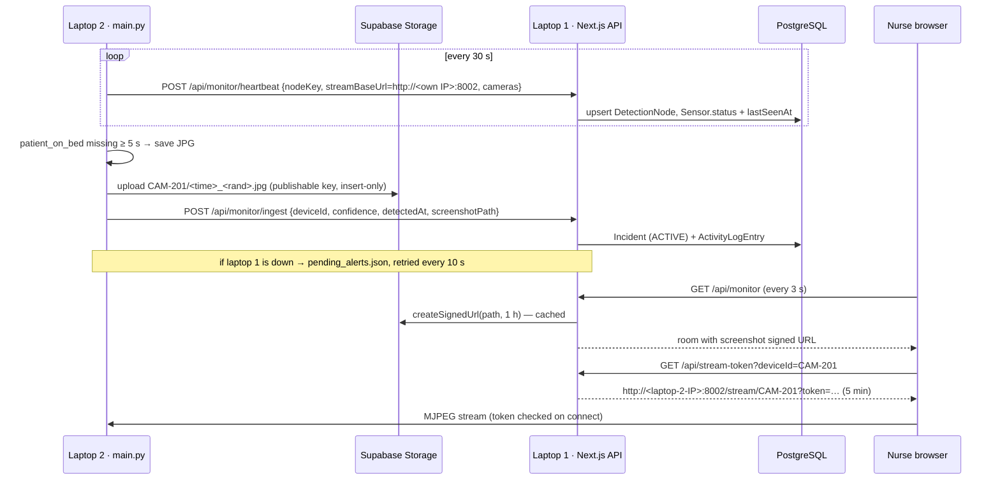

<!-- location: docs/detection-node/README.md -->
# Module: Remote Detection Node (two laptops on one Wi-Fi)

This module lets the FallDetect web app run on the **head nurse's laptop (laptop 1)** while
the cameras and YOLO model run on a **separate camera laptop (laptop 2)** on the same Wi-Fi.
Fall screenshots are stored in a **private Supabase Storage bucket**.

It also includes three fixes from the TDS review: #10 (admin Sensor ID not saved as
`deviceId`), #11 (no role check on admin screens) and #12 (missing facility filter on
Simulate fall).

## Documents in this zip

| File | Read it when |
|---|---|
| `docs/detection-node/LAN_SETUP.md` | Setting up the two laptops, Supabase, firewall and IPs |
| `docs/detection-node/PATCHES.md` | Editing existing project files (schema, proxy, CameraFeed, admin rooms, …) |
| `docs/detection-node/E2E_TESTS.md` | Testing end-to-end and recording results for the paper |
| `backend/MAIN_PY_INTEGRATION.md` | Wiring the new Python modules into `main.py` |

## How it works



## Files

```text
frontend/
├── app/(protected)/admin/detection-nodes/page.tsx       basic test page: camera laptops + live preview
├── app/api/monitor/heartbeat/route.ts                   POST  (bearer secret)
├── app/api/monitor/ingest/route.ts                      POST  (bearer secret) — REPLACES existing
├── app/api/stream-token/route.ts                        GET   (session)
├── app/api/detection-nodes/route.ts                     GET   (admin)
├── app/api/detection-nodes/[nodeId]/route.ts            DELETE (admin)
├── components/detection-node/
│   ├── DetectionNodesScreen.tsx    NodeCard.tsx    NodeStatusBadge.tsx
│   ├── DeleteNodeDialog.tsx        RemoteCameraFeed.tsx  (reuse in Live Monitor)
├── lib/detection-node/             client: types, constants, api (axios), queries, hooks, utils
│   ├── types.ts  constants.ts  api.ts  queries.ts  utils.ts
│   ├── useDetectionNodes.ts        useRemoteCameraFeed.ts
├── lib/detection-node-server/      server-only
│   ├── machine-auth.ts  status.ts  stream-token.ts  validators.ts
│   ├── projection.ts    supabase-storage.ts
├── lib/auth/guards.ts              requireUser / requireAdmin
├── lib/api/client.ts               axios instance (replaces the unused one)
├── lib/api/errors.ts               jsonError, isUniqueViolation
├── proxy.ts                        REPLACES existing (see PATCHES.md §5)
├── prisma/schema.detection-node.prisma    blocks to merge into schema.prisma
├── prisma/sql/one_open_incident_per_room.sql
├── prisma/seed-detection-node.ts          demo nodes (additive; --reset removes them)
├── prisma/scripts/backfill-device-ids.ts  data repair for fix #10
├── scripts/simulate-node.mjs              fake camera laptop for testing
└── .env.example
backend/
├── config.py            REPLACES existing: all settings from .env
├── node_client.py       Supabase upload, alert retry queue, heartbeat, LAN IP detection
├── stream_server.py     Flask MJPEG server with token check (replaces the one in main.py)
├── stream_auth.py       stream token verification
├── stream_utils.py      downscale + JPEG encode
├── demo_stream.py       whole chain without YOLO/webcam
├── check_node.py        pre-flight checks
├── requirements-node.txt   .env.example   MAIN_PY_INTEGRATION.md
supabase/storage-setup.sql   private bucket + upload-only policy
```

## API

| Method | Path | Auth | Request | Success | Errors |
|---|---|---|---|---|---|
| POST | `/api/monitor/heartbeat` | Bearer ingest secret | `{ nodeKey, name?, streamBaseUrl, cameras: [{ deviceId, status }] }` | 200 `{ nodeId, accepted[], ignored[] }` | 400 invalid, 401, 404 no known camera |
| POST | `/api/monitor/ingest` | Bearer ingest secret | `{ deviceId, confidence, detectedAt, eventType: "fall", screenshotPath? }` | 201 `{ roomId, incidentId }` or 200 `{ status: "already_open", incidentId }` | 400 invalid / wrong screenshot path, 401, 404 |
| GET | `/api/stream-token?deviceId=` | Session | — | 200 `{ online: true, streamUrl, expiresAt }` or `{ online: false, reason, lastHeartbeatAt }` | 400, 401, 404 other facility / unknown |
| GET | `/api/detection-nodes` | Admin | — | 200 `DetectionNode[]` | 401, 403 |
| DELETE | `/api/detection-nodes/{nodeId}` | Admin | — | 200 `{ ok: true }` | 401, 403, 404 |

Rules:
- `status` is `online | degraded | offline`.
- `streamBaseUrl` must be `http://` on a LAN address (10.x, 172.16–31.x, 192.168.x,
  localhost, `*.local`), or any `https://` URL.
- `screenshotPath` must be `<deviceId>/<name>.jpg`. The old `screenshot` local path field is
  still accepted for single-machine dev.
- Errors use `{ "error": "message" }`. The 401 no longer includes a `debug` field.

## Design decisions

- **Status is derived, not stored**, like room state (TDS §5.3). A laptop is online if its
  last heartbeat is under 90 s old (`NODE_OFFLINE_AFTER_SEC`). No cron job is needed, and a
  crashed laptop simply goes stale. Sensors that no laptop manages keep their stored status,
  so the seed data still displays normally.
- **Laptop 2's IP isn't configured anywhere.** It's detected and sent in each heartbeat, so a
  DHCP change fixes itself within 30 s. Only laptop 1 needs a fixed address.
- **One open incident per room is enforced by the database** (partial unique index), not just
  by application code. Simultaneous alerts can't create duplicates, and the loser gets
  `already_open`.
- **Screenshots are private.**
  - Laptop 2's publishable key can only *insert* `.jpg` files one folder deep.
  - Laptop 1's secret key signs 1-hour URLs that only authenticated responses contain.
  - Ingest only accepts paths under the reporting camera's own folder.
- **A missing picture never delays an alert.** The upload has a 5 s limit and the alert goes
  out without a screenshot on failure. Only the first alert of an episode uploads.
- **Alerts survive laptop 1 being down.** They're queued in `pending_alerts.json`, retried in
  order, and dropped after 60 min.
- **Video is token-protected.** Anyone on the Wi-Fi could otherwise watch residents.
  - Tokens are HS256 JWTs signed by laptop 1 with `STREAM_TOKEN_SECRET`, valid 5 minutes, and
    bound to one camera.
  - They're checked when the stream connects.
  - Video goes browser → laptop 2 directly. It never passes through Next.js.

## Environment variables

Laptop 1 (`frontend/.env`):
- `DATABASE_URL`, `AUTH_JWT_SECRET`, `COOKIE_SECURE=false`
- `MONITOR_INGEST_SECRET`*, `STREAM_TOKEN_SECRET`*
- `SUPABASE_URL`, `SUPABASE_SECRET_KEY`, `SUPABASE_BUCKET`
- optional `NODE_OFFLINE_AFTER_SEC`

Laptop 2 (`backend/.env`):
- `FRONTEND_BASE_URL`, `MONITOR_INGEST_SECRET`*, `STREAM_TOKEN_SECRET`*
- `NODE_KEY`, `NODE_NAME`
- `SUPABASE_URL`, `SUPABASE_UPLOAD_KEY`, `SUPABASE_BUCKET`
- `CAMERA_ID_MAP`, `WEIGHTS_PATH`
- stream tuning (`STREAM_FPS`, `STREAM_MAX_WIDTH`, `STREAM_JPEG_QUALITY`)

\* must be identical on both laptops. Both folders have an `.env.example` with comments.

## Quick start

1. `docs/detection-node/LAN_SETUP.md` §1–2: network test and Supabase.
2. `docs/detection-node/PATCHES.md` §1–3: packages, shadcn components, schema + migrations.
3. `npx prisma db seed` then `npm run seed:nodes`, then open `/admin/detection-nodes` as
   admin. You'll see two demo laptops, one online and one offline; the online one goes
   offline after 90 s.
4. `npm run simulate:node -- heartbeat` and `npm run simulate:node -- ingest CAM-201`
   exercise the API without laptop 2.
5. On laptop 2: `python check_node.py`, then `python demo_stream.py --alert CAM-201`.
6. Apply the rest of `PATCHES.md`, integrate `main.py`, run `docs/detection-node/E2E_TESTS.md`.

## Assumptions about the existing code

These come from the TDS. Adjust the imports if yours differ.
- `import { prisma } from "@/lib/db/prisma"`, and the Prisma client is generated at
  `app/generated/prisma` with `client.ts` as the entry (Prisma 7 `prisma-client` generator).
  The seed scripts import `../app/generated/prisma/client`; match `prisma/seed.ts`.
- Relation names: `Sensor.room`, `Room.floor`, `Room.resident`, `Room.sensor`,
  `Floor.facilityId`, and model accessors `activityLogEntry` and `incident`.
- The admin layout wraps pages in a `QueryProvider` (TDS §8.1), and `@/lib/utils` exports `cn`.
- The JWT uses HS256, issuer `falldetect`, cookie `fd_session`, and claims `userId`, `email`,
  `facilityId`, `role` (TDS §9.1).

## Known limitations

- Screenshots need internet on both laptops. Alerts and video don't.
- Laptop 1 is a single point of failure. If it's off, alerts wait on laptop 2 (up to 60 min)
  but nobody is notified.
- An open MJPEG stream keeps playing after its 5-minute token expires. Only new connections
  are checked.
- Signed screenshot URLs are valid for up to 1 hour for anyone who copies one from the
  dashboard.
- Plain http on the LAN isn't encrypted. Someone sniffing the Wi-Fi could see traffic, so use
  a WPA2/WPA3-protected network you control.
